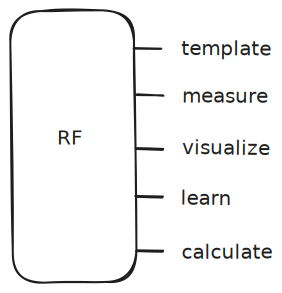

# 'rf' Command-Line Tool for RF Designers

'rf' is a Python-based command-line interface (CLI) tool tailored for radio frequency (RF) designers who are comfortable with Linux and CLI environments. It offers a suite of utilities to streamline RF design tasks, including calculations, data visualization, and hardware control.


## Features

- :abacus: **Calculations**: Perform essential RF computations such as Friis transmission equations and impedance matching.
```bash
rf calculate
```
- :bar_chart: **Data Visualization**: Get a dashboard of visualizations by inputting a csv-
  or s2p-file.
```bash
rf visualize
```
- :electric_plug: **Hardware Control**: Perform common measurements for RF design using
  instruments connected by LAN or USB. Get a screen dump, raw data or simply
  setup your spectrum analyzer with your favorite presets. Use with `rf visualize`
  for an extremely efficient workflow.
```bash
rf measure
```
- :books: **Ressource and Litterature Management**: Manage, search and organize books,
  slides, urls and more. Think Elsevier meets bookmarks meets terminal.
```bash
rf learn
```
- :clipboard: **Templating**: Interactively construct templates and scripts for commonly
  used software in RF engineering. 
```bash
rf template
```

## Design Principles

- Use standard in/out/err
   - stdin for inputs (plain text, json or file)
   - stdout for outputs (plain text, json or file)
   - stderr for all messages to the user (should not be passed on, keeps piping
     possible)
- Use signals
- Use exit codes when possible
- Use line-based text for inputs and outputs.
- Use JSON for organized inputs and outputs.
- The tool should have comprehensive help text
- The help and other documentation should contain examples
- The tool should suggest what command to run next if relevant
- The tool should suggest what to do next in case of an error
- Using the tool should be a conversation. Use this for naming things, help and
  runtime messages.
- Commands must be idempotent
- Keep it simple
- Use pypager for long text


## Commands



General Options:

### status

### rf-visualize

Result:

- Host dashboard server with standardized visualisation for all file types. 
   - Metadata in the header
   - Nicely formatted table
   - Plots of each column of data

Flags and Parameters:

- s2p data for stdin (flag: --s2p)
- csv data for stdin (flag: --csv)
- stable json output (flag: --json)
- stable plain text output (flag: --plain)

Options:

- Suppress stderr (option: -q)

## Installation

Ensure you have Python 3.7 or higher installed.

1. **Clone the Repository**:

   ```bash
   git clone https://github.com/rasand-arb/rf.git
   ```

2. **Navigate to the Project Directory**:

   ```bash
   cd rf
   ```

3. **Set Up a Virtual Environment** (recommended):

   ```bash
   python -m venv venv
   source venv/bin/activate # On Windows, use venv\Scripts\activate
   ```

4. **Install Dependencies**:

   ```bash
   pip install -r requirements.txt
   ```
   or
   
   ```bash
   uv pip install -r requirements.txt
   ``

5. **Install the Package**:

   ```bash
   pip install .
   ```

## Usage

After installation, the `rf` command becomes available.

```bash
rf --help
```

This displays the help message with available commands and options.

### Example: Calculating Friis Transmission

```bash
rf calculate-friis --pt_dbm 10 --gt_db 2 --gr_db 2 --f_mhz 2400 --d_km 1
```

This computes the received power using the Friis transmission equation.

## Contributing

Contributions are welcome!

1. **Fork the Repository**:

   Click the "Fork" button on the top right of the repository page.

2. **Create a Feature Branch**:

   ```bash
   git checkout -b feature/YourFeatureName
   ```

3. **Commit Your Changes**:

   ```bash
   git commit -m 'Add some feature'
   ```

4. **Push to the Branch**:

   ```bash
   git push origin feature/YourFeatureName
   ```

5. **Open a Pull Request**:

   Navigate to the repository on GitHub and click the "New Pull Request" button.

## License

This project is licensed under the MIT License. See the [LICENSE](LICENSE) file for details.

## Acknowledgments

- [Typer](https://typer.tiangolo.com/) for the CLI framework.
- [scikit-rf](https://scikit-rf.readthedocs.io/) for RF computations.
- [Matplotlib](https://matplotlib.org/) for data visualization.
- [clig.dev](https://clig.dev/) for Guidelines on CLI design

## Roadmap

- Add instrument communications
   - add_instrument (factory)
      - protocol: ONLY LAN ACCEPTED
   - 
---
